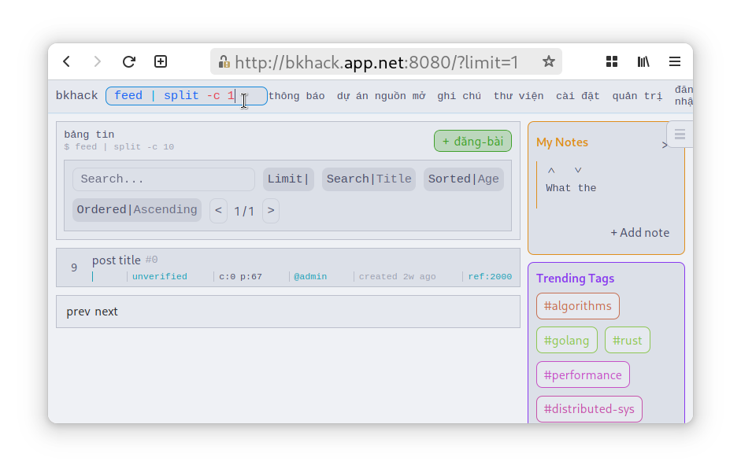

bkhack: Bách Khoa Hack
======================
`bkhack` is an abstract, heterogeneous full-stack application, currently deployed as a social news website at Ho Chi Minh University of Technology.

The following paper provides more details:

&nbsp;&nbsp;&nbsp;&nbsp;&nbsp;&nbsp;&nbsp;&nbsp;&nbsp;&nbsp;&nbsp;&nbsp;Develop an educational computer-science-oriented social news website for Ho Chi Minh University of Technology ([pdf][bkhack-paper])  
&nbsp;&nbsp;&nbsp;&nbsp;&nbsp;&nbsp;&nbsp;&nbsp;&nbsp;&nbsp;&nbsp;&nbsp;Phát triển mạng xã hội giáo dục hướng Khoa học Máy tính tại Đại học Bách Khoa TP.HCM  
&nbsp;&nbsp;&nbsp;&nbsp;&nbsp;&nbsp;&nbsp;&nbsp;&nbsp;&nbsp;&nbsp;&nbsp;Lê Nguyễn Gia Bảo, Lê Công Minh Khang, and Hồ Gia Tường  
&nbsp;&nbsp;&nbsp;&nbsp;&nbsp;&nbsp;&nbsp;&nbsp;&nbsp;&nbsp;&nbsp;&nbsp;Undergraduate Thesis 2026  
&nbsp;&nbsp;&nbsp;&nbsp;&nbsp;&nbsp;&nbsp;&nbsp;&nbsp;&nbsp;&nbsp;&nbsp;[Project Repository][bkhack-repo] [Thesis Paper (pdf)][bkhack-paper] [Live Deployment][bkhack-firebase]


---

## Installation

Add the [bkhack repository][bkhack-repo] to OPAM:

```sh
opam remote add bkhack-repo git+https://github.com/ttb-hcmut/bkhack
```

Install the package:

```sh
opam install bkhack
```

[bkhack-repo]: https://github.com/ttb-hcmut/bkhack

---

## Usage

`bkhack` is distributed as both reusable OCaml/Reason library. You can integrate it into your own Reason application:

```dune
(rule
 (alias bundle)
 (deps (:static (source_tree Static))
       ; ...
       (:src (alias core))
       (:serve (alias Service/default)))
 (action
  (run bkhack-tools.webpackgen
       -static %{static}
       ; ...
       -src %{src}
       -serve %{serve})
  ))
(melange.emit
 (alias core)
 ; ...
 (preprocess (pps ppx_comptime))
 (libraries bkhack))
```

Bundle the application for deployment:

```sh
dune build @bundle
```

This produces a `_build/${context}/${src}/dist/` directory containing static HTML and JavaScript bundles
suitable for deployment platforms such as Firebase Hosting or Netlify, and a `_build/${context}/${src}/distserve/` directory containing a dockerized Elixir bundle suitable for deployment platforms such as GCP Compute Engine or Fly.io.

For demonstration, let's assume you want to run the website locally

```sh
(cp -rf _build/${context}/${src}/dist dist && pnpm exec live-server --cors dist 8080) &
({ cp -rf _build/${context}/${src}/distserve distserve && cp _build/${context}/${src}/distserve/config/shell.nix.ex distserve.nix ;} && nix-shell distserve.nix --run "cd distserve && mix deps.get && mix run --no-halt"); wait
```



---

## Development

See [DEVELOPMENT.md](./DEVELOPMENT.md) for more details.

---

## Try It Out

The current deployment is [available here!][bkhack-firebase]

[bkhack-repo]: https://github.com/ttb-hcmut/bkhack
[bkhack-paper]: https://baorepo.web.app/~ttb-hcmut/bkhack.pdf
[bkhack-firebase]: https://bkhack-2eb8c.web.app
